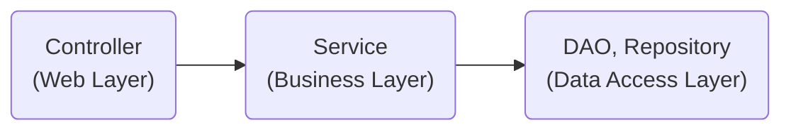

# 헥사고날(육각형), 포트와 어댑터 아키텍처

> 애플리케이션은 비즈니스 관심사를 다루는 내부와 기술적인 관심사를 다루는 외부로 분해된다.<br>
> 여기서 외부에 포함된 기술적인 컴포넌트를 어댑터라 부르고, 어댑터가 내부와 상호작용하는 접점을 포트라 부른다.


## 1. 계층형 아키텍처의 문제

---

#### 계층형 아키텍처란?

흔히 사용하는 mvc 패턴의 전형적인 구조이다.



1. 데이터 주도 설계를 유도한다.
    - 객체 모델링은 상태(state)가 아닌 행동(behavior)을 중심으로 모델링해야 하는데, 계층형 아키텍처는 상태를 중심으로 생각하게 만들며 DB 모델링 중심이 된다.
2. 트랜잭션 스크립트를 유도한다.
    - 중복되는 코드 유발
    - 소스 파악이 힘듬 (전체 코드를 읽고 따라가야 한다.)
3. 유스케이스를 숨긴다.
    - 코드의 의도를 파악하기 힘들다.
4. 지름길을 택하기 쉬워진다.
    - 특정 레이어에 적합한 규칙이 있지만 강제되지 않기에 깨진 창문 이론이 발생할 여지가 높다.
5. 테스트가 어려워진다.
    - 여러 개의 유스케이스를 담당하는 아주 넓은 서비스가 만들어지기도 한다.
    - UserService >>> JoinUserService 변경이 필요
6. 동시작업이 어렵다.

## 2. 의존성 역전하기

---

### 단일 책임 원칙 (Single responsibility principle)
> 단일책임원칙 (SRP)의 일반적인 해석은 다음과 같다. `하나의 컴포넌트는 오로지 한 가지 일만 해야 하고, 그것을 올바르게 수행해야 한다.`  
> 좋은 조언이지만 단일 책임 원칙의 실제 의도는 아니다. 단일 책임 원칙의 실제 정의는 `컴포넌트를 변경하는 이유는 오직 하나 뿐이어야 한다.` 와 같다.   
> 만약 컴포넌트를 변경할 이유가 오직 한 가지라면 컴포넌트는 딱 한 가지 일만(책임)만 갖게 된다.

#### 단일 책임 원칙 위배
+ 코드가 실제로 어떤 일을 하는지를 이해하기 쉽지 않다.
+ 코드의 한 영역을 변경함으로써 다른 영역에 부수효과들이 생겨난다.

### 의존성 역전 원칙 (Dependency inversion principle)

+ `코드안의 어떤 의존성이든 그 방향을 바꿀 수(역전시킬 수) 있다.`
    - 양 쪽 코드를 모두 제어할 수 있을 때만 의존성을 역전시킬 수 있다.
+ `추상화는 구체적인 사항 의존해서는 안되며 구체적인 사항은 추상화에 의존해야 한다.`
    - 여기서 말하는 추상화란 추상 클래스나 인터페이스가 아닌 추상화된 개념을 말한다.
    - 비즈니스 코드가 기술적인 세부 사항에 의존해서는 안 된다는 의미다.

계층형 아키텍처의 경우 계층 간 의존성은 항상 다음 계층인 아래 방향을 가르킨다. (의존성의 방향 : Controller > Service > DAO)
단일 책임 원칙을 고수준에서 적용할 때 controller, service 등의 상위 계층(고수준 모듈)은 DAO 라는 하위 계층(저수준 모듈)에 의존하게 된다.

`DIP 는 의존 관계를 역전시켜서 하위 계층이 상위 계층(더 추상화된 개념들)에 의존하도록 구현하는 것을 의미한다.`

영속성 계층에 대한 도메인 계층의 의존성 때문에 영속성 계층을 변경할 때마다 잠재적으로 도메인 계층도 변경해야 한다.

JPA 는 도메인 영역에 (추상화된)리포지토리를 두어서 영속성 레이어에 의존성으로부터 도메인 로직을 해방시켰다.

[stackoverflow](https://stackoverflow.com/questions/67153991/application-with-interchangeable-persistance-layer)

#### 클린 아키텍처
> 클린 아키텍처란 도메인 코드 밖으로는 어떠한 의존성도 없어야 함을 의미힌다. 대신 의존성 역전 원칙의 도움으로 모든 의존성이 도메인을 향하고 있다.

##### 클린 아키텍처의 추상화된 모습 (헥사고날 아키텍처)

[출처 : 넷플릭스](https://netflixtechblog.com/ready-for-changes-with-hexagonal-architecture-b315ec967749)

##### 특징
+ 도메인 영역에서는 어떤 영속성 프레임워크나 UI 프레임워크가 사용되는지 알 수 없다.
    - 특정 프레임워크에 종속되지 않는다.
    - 비즈니스 규칙에만 집중할 수 있다.

##### 구조
육각형 안에는 도메인 엔티티와 이와 상호작용하는 유스케이스가 있다.
육각형 바깥에는 애플리케이션과 상호작용하는 다양한 어댑터들이 있다.

왼쪽으로는 애플리케이션을 주도하는 어댑터(애플리케이션 코어를 호출)이며, 오른쪽은 애플리케이션에 의해 주도되는 어댑터(애플리케이션 코어에 의해 호출)들이다.


ref.
- 만들면서 배우는 클린 아키텍처
- [우아한 테크세미나 - 조영호](https://www.youtube.com/watch?v=dJ5C4qRqAgA)

## 3. 코드 구성하기

---

### 아키텍처적으로 표현력 있는 패키지 구조

```
my-project
└── account
    ├── adapter
    |   |── in
    |   |   └── ui   
    |   |       └── AccountController : SendMoneyUseCase
    |   |── out
    |   |   └── persistence
    |   |       |── AccountPersistenceAdapter        
    |   |       └── SpringDataAccountRepository  
    ├── domain
    |   |── Account        
    |   └── Activity
    |
    └── application
        └── SendMoneyService : LoadAccountPort
        └── port : 어댑터의 기능을 실행하기 위해 포트 인터페이스를 호출
            |── in 
            |   └── SendMoneyUseCase : (DI) 포트 인터페이스를 구현한 실제 SendMoneyService 객체를 주입  
            └── out
                |── LoadAccountPort : (DI) AccountPersistenceAdapter 인터페이스 주입        
                └── UpdateAccountStatePort
```

##### 장점
+ 바깥과 통신하기 위해선 애플리케이션 내에 port 통해야 한다.
+ 애플리케이션 계층에서 어댑터 클래스로 향하는 우발적인 의존성이 존재할 수 없다.
+ 애플리케이션의 기능 조각이나 특성을 구분 짓는 패키 경계가 존재한다.
+ 애플리케이션이 어떤 유스케이스들을 제공하는지 파악하기 쉽다.
    + 어떤 기능이 ui 어댑터에서 호출되는지, 영속성 어댑터가 도메인 계층에 어떤 기능을 제공하는지 한눈에 알아보기 쉽다.
+ 가시성이 좋다.
+ 도메인 코드의 OCP, DIP 를 유지하기 쉽다.
+ 적극적인 사고를 촉진한다. (생각하는 프로그래밍?)
+ DDD 개념과 알맞다.

#### 의존성 주입의 역할
> 클린 아키텍처의 가장 본질적인 요건은 애플리케이션의 계층이 인커밍/아웃고잉 어댑터에 의존성을 갖지 않는 것이다.

1. 어댑터는 그저 애플리케이션 계층에 위치한 서비스를 호출할 뿐이다.
2. 애플리케이션 계층으로의 진입점을 구분 짓기 위해 실제 서비스를 포트 인터페이스들 사이에 숨겨둔다.
3. 모드 계층에 의존성을 둔 중립 컴포넌트를 둔다. : SendMoneyService

 ```JAVA
class AccountController {
    private final SendMoneyUseCase sendMoneyUseCase;
}

interface SendMoneyUseCase {
    boolean sendMoney(SendMoneyCommand command);
}

class SendMoneyService implements SendMoneyUseCase {
    private LoadAccountPort loadAccountPort;

    @java.lang.Override
    public boolean sendMoney(SendMoneyCommand command) {
        return false;
    }
}

// AccountController 가 SendMoneyUseCase 를 필요로 하기 때문에 의존성 주입을 통해 SendMoneyService 를 주입한다.

class LoadAccountPort {
    Account loadAccount(AccountId accountId, LocalDateTime baselineDate);
}

class AccountPersistenceAdapter implements LoadAccountPort {
    @java.lang.Override
    Account loadAccount(AccountId accountId, LocalDateTime baselineDate) {
        return super.loadAccount(accountId, baselineDate);
    }
}

// SendMoneyService 인스턴스를 만들 때도 LoadAccountPort 인터페이스로 가장한 AccountPersistenceAdapter 를 주입한다.
 ```

## 4. 유스케이스 구현

---

### 유스케이스 둘러보기

1. in coming adapter 로부터 입력을 받는다.
2. <Strong>비즈니스 규칙을 검증한다.</Strong>
3. 모델 상태를 조작한다.
4. 출력을 반환한다.

비즈니스 규칙을 충족한 유스케이스는 입력을 기반으로 모델의 상태를 변경한다.

## 5. 웹 어댑터 구현하기

---

### 웹 어댑터의 책임
1. HTTP 요청을 객체로 매핑
2. 권한 검사
3. 입력 유효성 검증
4. <Strong>입력을 유스케이스의 입력 모델로 매핑</Strong>
5. 유스케이스 호출
6. 유스케이스의 출력을 HTTP로 매핑
7. HTTP 응답을 반환

### 컨트롤러 나누기


```JAVA

@RestController
@RequiredArgsConstructor
public class AccountController {
    private final GetAccountBalanceQuery getAccountBalanceQuery;
    private final ListAccountsQuery listAccountsQuery;
    private final LoadAccountQuery loadAccountQuery;
    
    private final SendMoneyUseCase sendMoneyUseCase;
    private final CreateAccountUseCase createAccountUseCase;
    
    @GetMapping
    public List<AccountResource> accounts() {
        ...
    }
    
    @GetMapping("/accounts/{accountId}")
    public AccountResource account(@PathVariable("accountId") Long accountId) {
        ...
    }
    
    @GetMapping("/accounts/{accountId}/balance")
    public long accountBalance(@PathVariable("accountId") Long accountId) {
        ...
    }

    @PostMapping("/accounts")
    public AccountResource createAccount(@RequestBody AccountResource accountResource) {
        ...
    }
    
}
```

### 문제와 해결

1. 시간이 지나면서 컨트롤러와 테스트 코드를 파악하기가 힘들어진다.
2. 모든 연산을 단일 컨트롤러에 넣는 것은 데이터 구조(AccountResource)의 재활용을 촉진한다.
3. 컨트롤러와 서비스 객체 이름이 명확하지 않다.
    - CreateAccount > RegisterAccount
4. 동시작업이 어렵다.
5. 많은 의존성이 존재한다.
    - 많은 의존성은 객체의 책임을 증가 시킨다.

```JAVA
@RestController
@RequiredArgsConstructor
public class SendMoneyController {

    private final SendMoneyUseCase sendMoneyUseCase;

    @PostMapping("/accounts/send/{sourceAccountId}/{targetAccountId}/{amount}")
    public void sendMoney(
            @PathVariable("sourceAccountId") Long sourceAccountId,
            @PathVariable("targetAccountId") Long targetAccountId,
            @PathVariable("amount") Long amount
    ) {
        // 웹 어댑터의 입력 모델을 유스케이스의 입력 모델로 변환할 수 있다
        SendMoneyCommand command = new SendMoneyCommand(
                new AccountId(sourceAccountId),
                new AccountId(targetAccountId),
                Money.of(amount));
        
        sendMoneyUseCase.sendMoney(command);
    }
}
```

작은 컨트롤러는 처음에는 조금 더 공수가 들겠지만 유지보수하는 동안에는 더 파악하기 쉽고, 테스하기 쉬우며, 동시 작업을 지원할 것이다.

## 6. 영속성 어댑터 구현하기

---

> 헥사고날 아키텍처에서 영속성 어댑터는 '주도되는' 혹은 '아웃고잉' 어댑터다.

포트는 애플리케이션 서비스와 영속성 코드 사이에서 간접적인 계층을 제공한다. 영속성 문제에 신경 쓰지 않고 도메인 코드를 개발하기 위해 간접 계층을 추가하고 있다.

### 영속성 어댑터의 책임

1. 입력을 받는다.
2. 입력을 데이터베이스 포맷으로 매핑한다.
3. 입력을 데이터베이스로 보낸다.
4. 데이터베이스 출력을 애플리케이션 포맷으로 매핑한다.
5. 출력을 반환한다.

핵심은 영속성 어댑터의 입력 모델이 애플리케이션 코어에 위치함으로 영속성 어댑터 내부를 변경하는 것이 코어에 영향을 미치지 않는다.

### 포트 인터페이스 나누기

#### ISP (Interface Segregation Principle)

> '필요없는 화물을 운반하는 무언가에 의존하고 있으면 예상하지 못했던 문제가 생길 수 있다.'

이 원칙은 클라이언트가 오로지 자신이 필요로 하는 메서드만 알면 되도록 넓은 인터페이스를 특화된 인터페이스로 분리해야 한다고 설명한다.

```JAVA

class SendMoneyService {
    private final LoadAccountPort loadAccountPort;
    private final UpdateAccountPort updateAccountPort;
    
    SendMoneyService(LoadAccountPort loadAccountPort, UpdateAccountPort updateAccountPort) {
        this.loadAccountPort = loadAccountPort;
        this.updateAccountPort = updateAccountPort;
    }
}

class RegisterAccountService {
    private final CreateAccountPort createAccountPort;

    RegisterableService(CreateAccountPort createAccountPort){
        this.CreateAccountPort = createAccountPort;
    }
}


```


## 7. 아키텍처 요소 테스트하기

---

### 테스트 피라미드

헥사고날 아키텍처를 테스트하기 위한 계층들은 단위테스트, 통합테스트, 시스템 테스트가 존재한다.
테스트 피라미드는 아래에 위치 할 수록 실행이 빠르며, 비용이 싸고 테스트가 견고하다. 

#### 단위 테스트

> 피라미드의 토대에 해당하며, 보통 하나의 클래스를 인스턴스화하고 해당 클래스의 인터페이스를 통해 기능들을 테스트한다.
만약 테스트 중인 클래스가 다른 클래스에 의존한다면 필요한 작업들을 위해 mock 으로 대체한다.

도메인 엔티티, 유스케이스를 검증하기에 좋다.

--- 

#### 통합 테스트

> 피라미드의 중간에 위치하며 연결된 여러 유닛을 인스턴스화하고 시작점이 되는 클래스의 인터페이스로 데이터를 보낸 후 유닛들의 네트워크가 기대한대로 동작하는지 검증한다.
책에서 정의한 통합 테스트에는 두 계층 간의 경계를 걸쳐서 테스트할 수 있기 때문에 객체 네트워크가 완전하지 않다면 mock을 대상으로 수행한다.

##### 웹 어댑터 테스트

- HTTP 요청을 자바 객체로 매핑 @WebMockMvc
- 권한 검사
- 입력 유효성 검증
- 입력을 유스케이스의 입력 모델로 매핑 @WebMockMvc
- 유스케이스 호출
- 유스케이스의 출력을 HTTP 로 매핑 @WebMockMvc
- HTTP 응답을 반환 @WebMockMvc

##### 영속성 어댑터 테스트

- 입력을 받는다.
- 입력을 데이터베이스 포맷으로 매핑한다. @DataJpaTest
- 입력을 데이터베이스로 보낸다. @DataJpaTest
- 데이터베이스 출력을 애플리케이션 포맷으로 매핑한다. @DataJpaTest
- 출력을 반환한다.

--- 

##### 시스템 테스트

> 피라미드 꼭대기에 위치하며 애플리케이션을 구성하는 모든 객체 네트워크를 가동시켜 특정 유스케이스가 전 계층에서 잘 동작하는지 검증한다.

시스템 테스트는 여러 개의 유스케이스를 결합해서 시나리오를 만들 때 더 빛이 난다.

--- 


- 테스트 커버리지가 중요한게 아닌 신회할 수 있는 테스트가 필요하다. 
- 리팩터링할 때마다 테스트 코드를 변경해야 한다면 테스트는 테스트로서의 가치를 잃는다.
- 입출력 포트는 테스트에서 아주 뚜렷한 모킹 지점이 된다.

<br>
<br>


### 8. 경계 간 매핑하기

--- 
#### 매핑하지 않기

> 모든 계층에서 도메인 객체를 접근하는 전략 

- 간단한 CRUD 작업에서는 좋다.
- 모든 계층이 정확히 같은 구조와 정보를 필요로 한다면 이 전략은 완벽한 선택지다.

문제점

- 애플리케이션, 도메인, 웹과 영속성 문제를 다루게 되면 문제가 된다.
- 간단한 CRUD 유스케이스도 시간이 지남에 따라 진화할 수 있다.

--- 
#### 양방향 매핑 

> 웹 모델과 영속성 모델, 도메인 객체를 활용한 매핑 전략

- 각 계층이 전용 모델을 가지고 있는 덕분에 각 계층이 전용 모델을 변경하더라도 다른 계층에 영향이 없다.
- 웹 모델은 데이터를 최적으로 표현할 수 있는 구조를 가질 수 있고, 도메인 모델은 유스케이스를 제일 잘 구현할 수 있는 구조를 가질 수 있다.
- 영속성 모델은 데이터베이스에 객체를 저장하기 위해 ORM 에서 필요로 하는 구조를 가질 수 있다.

문제점 

- 너무 많은 보일러플레이트 코드가 생긴다.
- 도메인 모델이 계층 경계를 넘어서 통신하는 데 사용되고 있다. (포트에서 도메인 객체를 사용)

---

#### 완전 매핑

> 각 연산마다 별도의 입출력 모델을 사용하는 전략

- 애플리케이션 계층 사이에서 상태 변경 유스케이스의 경계를 명확히 할 때 가장 빛난다.

문제점

- 애플리케이션 계층과 영속성 계층 사이에서는 매핑 오버 헤드 때문에 사용하지 않는 것이 좋다. 

---

#### 단반향 매핑

> 모든 계층의 모델들이 같은 인터페이스를 구현하는 전략
> 이 때 사용하는 인터페이스는 특성에 대한 getter 메서드를 제공해서 도메인 모델의 상태를 캡슐화 한다.

- 동일한 상태 인터페이스를 구현하는 도메인 모델과 어댑터 모델을 이용하면 각 계층은 다른 계층으로부터 온 객체를 단방향으로 매핑하기만 하면 된다.
- 이 매핑은 팩터리라는 DDD 개념과 잘 어울린다. DDD 용어인 팩터리는 어떤 특정한 상태로부터 도메인 객체를 재공성할 책임을 가지고 있다.
- 계층 간의 모델이 비슷할 때 가장 효과적이다.

문제점

- 개념적으로 어렵다.


모든 매핑 전략은 장단점을 가지고 있으므로 그 상황에 맞는 전략을 사용하길 추천한다.


### 11. 의식적으로 지름길 사용하기

---

#### 왜 지름길은 깨진 창문 같을까?
> 어떤 것이 멈춘 것처럼 보이고, 망가져 보이고, 혹은 관리되지 않는다고 여겨지면 인간의 뇌는 이를 더 멈추고, 망가뜨리고, 해도 된다고 생각하게 된다

- 품질이 떨어진 코드에서 작업할 때 더 낮은 품질의 코드를 추가하기가 쉽다.
- 코딩 규칙을 많이 어긴 코드에서 작업할 때 또 다른 규칙을 어기기도 쉽다.
- 지름길을 많이 사용한 코드에서 작업할 때 또 다른 지름길을 추가하기도 쉽다.

#### 유스케이스 간 모델 공유하기
- 유스케이스 간 입출력 모델을 공유하는 것은 유스케이스들이 기능적으로 묶여 있을 때 유효하다. 즉, 특정 요구사항을 공유할 때 괜찮다는 의미다. 이 경우 특정 세부사항을 변경할 경우 실제로 두 유스케이스 모두에 영향을 주고 싶은 것이다.
- '변경할 이유' 즉 단일 책임 원칙을 위배한다.

#### 도메인 엔티티를 입출력 모델로 사용하기
- 유스케이스 변경이 도메인 엔티티까지 전파된다.
- 같은 모델을 사용한다면 최소 기능 제품으로 시작해서 점점 복잡도를 높여가는 애자일 환경에서는 특히 문제가 된다.

#### 인커밍 포트 건너 뛰기
- 인커밍 포트가 없으면 도메인 로직의 진입점이 불분명해진다.
- 인커밍 포트를 제거함으로써 인커밍 어댑터와 어플리케이션 계층 사이의 추상화 계층을 줄였다. 보통 추상화 계층을 줄이는 것은 괜찮게 느껴진다. 하지만 인커밍 포트는 애플리케이션 중심에 접근하는 진입점을 정의한다. 전용 인커밍 포트를 유지하면 훈눈에 진입점을 식별할 수 있다. 이는 새로운 개발자가 코드를 파악할 때 특히 더 도움 된다.
- 또 다른 이유는 아키텍처를 쉽게 강제할 수 있다. 인커밍 어댑터에서 호출할 의도가 없던 서비스 메서드를 실수로 호출하는 일이 절대 발생할 수 없다

#### 애플리케이션 서비스 건너너뛰기
- 애플리케이션 서비스가 없으면 도메인 로직을 둘 곳이 없다.
- 인커밍 어댑터와 아웃고잉 어댑터 사이에 모델을 공유해야 하며, 도메인 모델을 입력 모델로 상요하는 케이스가 된다. 아울러 애플리케이션에 코어에 유스케이스라고 할 만한 것이 없어진다.


