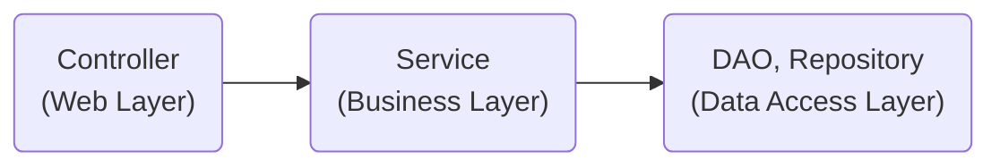
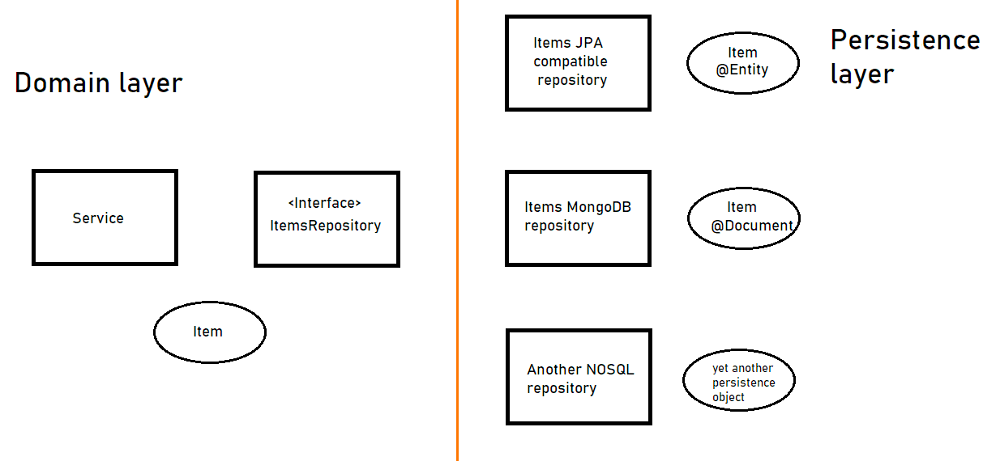
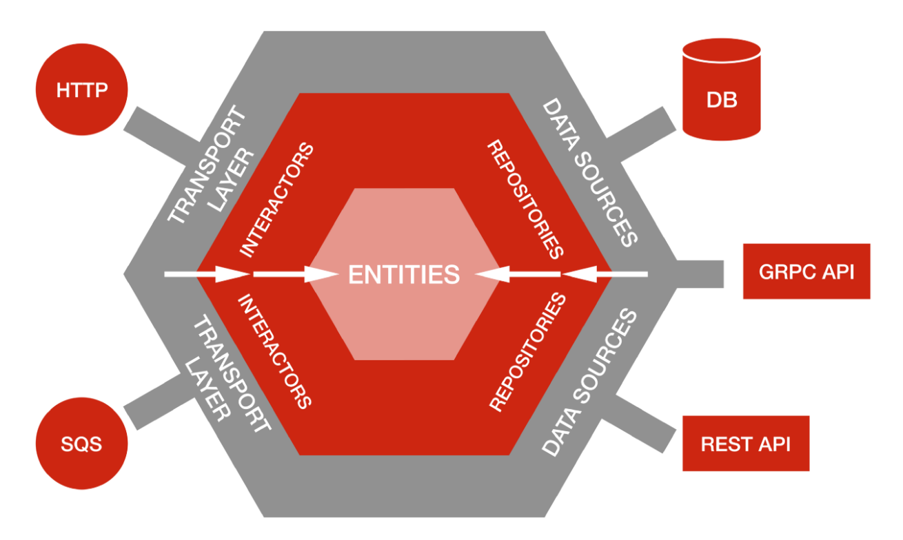

# 헥사고날(육각형), 포트와 어댑터 아키텍처

> 애플리케이션은 비즈니스 관심사를 다루는 내부와 기술적인 관심사를 다루는 외부로 분해된다.<br>
> 여기서 외부에 포함된 기술적인 컴포넌트를 어댑터라 부르고, 어댑터가 내부와 상호작용하는 접점을 포트라 부른다.


## 1. 계층형 아키텍처의 문제

#### 계층형 아키텍처란?

흔히 사용하는 mvc 패턴의 전형적인 구조이다.



1. 데이터 주도 설계를 유도한다.
   - 객체 모델링은 상태(state)가 아닌 행동(behavior)을 중심으로 모델링해야 하는데, 계층형 아키텍처는 상태를 중심으로 생각하게 만들며 DB 모델링 중심이 된다.
2. 트랜잭션 스크립트를 유도한다.  
   - 중복되는 코드 유발
   - 소스 파악이 힘듬 (전체 코드를 읽고 따라가야 한다.)
3. 유스케이스를 숨긴다.
   - 코드의 의도를 파악하기 힘들다.
4. 지름길을 택하기 쉬워진다.
   - 특정 레이어에 적합한 규칙이 있지만 강제되지 않기에 깨진 창문 이론이 발생할 여지가 높다.
5. 테스트가 어려워진다.
   - 여러 개의 유스케이스를 담당하는 아주 넓은 서비스가 만들어지기도 한다. 
   - UserService >>> JoinUserService 변경이 필요
6. 동시작업이 어렵다.

## 2. 의존성 역전하기

### 단일 책임 원칙 (Single responsibility principle)
> 단일책임원칙 (SRP)의 일반적인 해석은 다음과 같다. `하나의 컴포넌트는 오로지 한 가지 일만 해야 하고, 그것을 올바르게 수행해야 한다.`  
> 좋은 조언이지만 단일 책임 원칙의 실제 의도는 아니다. 단일 책임 원칙의 실제 정의는 `컴포넌트를 변경하는 이유는 오직 하나 뿐이어야 한다.` 와 같다.   
> 만약 컴포넌트를 변경할 이유가 오직 한 가지라면 컴포넌트는 딱 한 가지 일만(책임)만 갖게 된다.

#### 단일 책임 원칙 위배
+ 코드가 실제로 어떤 일을 하는지를 이해하기 쉽지 않다.
+ 코드의 한 영역을 변경함으로써 다른 영역에 부수효과들이 생겨난다.

### 의존성 역전 원칙 (Dependency inversion principle)

+ `코드안의 어떤 의존성이든 그 방향을 바꿀 수(역전시킬 수) 있다.` 
  - 양 쪽 코드를 모두 제어할 수 있을 때만 의존성을 역전시킬 수 있다.
+ `추상화는 구체적인 사항 의존해서는 안되며 구체적인 사항은 추상화에 의존해야 한다.`
  - 여기서 말하는 추상화란 추상 클래스나 인터페이스가 아닌 추상화된 개념을 말한다. 
  - 비즈니스 코드가 기술적인 세부 사항에 의존해서는 안 된다는 의미다.

계층형 아키텍처의 경우 계층 간 의존성은 항상 다음 계층인 아래 방향을 가르킨다. (의존성의 방향 : Controller > Service > DAO)
단일 책임 원칙을 고수준에서 적용할 때 controller, service 등의 상위 계층(고수준 모듈)은 DAO 라는 하위 계층(저수준 모듈)에 의존하게 된다.  

`DIP 는 의존 관계를 역전시켜서 하위 계층이 상위 계층(더 추상화된 개념들)에 의존하도록 구현하는 것을 의미한다.`

영속성 계층에 대한 도메인 계층의 의존성 때문에 영속성 계층을 변경할 때마다 잠재적으로 도메인 계층도 변경해야 한다.

JPA 는 도메인 영역에 (추상화된)리포지토리를 두어서 영속성 레이어에 의존성으로부터 도메인 로직을 해방시켰다. 

[stackoverflow](https://stackoverflow.com/questions/67153991/application-with-interchangeable-persistance-layer)

#### 클린 아키텍처
> 클린 아키텍처란 도메인 코드 밖으로는 어떠한 의존성도 없어야 함을 의미힌다. 대신 의존성 역전 원칙의 도움으로 모든 의존성이 도메인을 향하고 있다.

##### 클린 아키텍처의 추상화된 모습 (헥사고날 아키텍처)

[출처 : 넷플릭스](https://netflixtechblog.com/ready-for-changes-with-hexagonal-architecture-b315ec967749)

##### 특징
+ 도메인 영역에서는 어떤 영속성 프레임워크나 UI 프레임워크가 사용되는지 알 수 없다.
  - 특정 프레임워크에 종속되지 않는다.
  - 비즈니스 규칙에만 집중할 수 있다.

##### 구조
육각형 안에는 도메인 엔티티와 이와 상호작용하는 유스케이스가 있다.
육각형 바깥에는 애플리케이션과 상호작용하는 다양한 어댑터들이 있다.

왼쪽으로는 애플리케이션을 주도하는 어댑터(애플리케이션 코어를 호출)이며, 오른쪽은 애플리케이션에 의해 주도되는 어댑터(애플리케이션 코어에 의해 호출)들이다.


ref.
- 만들면서 배우는 클린 아키텍처
- [우아한 테크세미나 - 조영호](https://www.youtube.com/watch?v=dJ5C4qRqAgA)

## 3. 코드 구성하기

### 아키텍처적으로 표현력 있는 패키지 구조

```
my-project
└── account
    ├── adapter
    |   |── in
    |   |   └── ui   
    |   |       └── AccountController : SendMoneyUseCase
    |   |── out
    |   |   └── persistence
    |   |       |── AccountPersistenceAdapter        
    |   |       └── SpringDataAccountRepository  
    ├── domain
    |   |── Account        
    |   └── Activity
    |
    └── application
        └── SendMoneyService : LoadAccountPort
        └── port : 어댑터의 기능을 실행하기 위해 포트 인터페이스를 호출
            |── in 
            |   └── SendMoneyUseCase : (DI) 포트 인터페이스를 구현한 실제 SendMoneyService 객체를 주입  
            └── out
                |── LoadAccountPort : (DI) AccountPersistenceAdapter 인터페이스 주입        
                └── UpdateAccountStatePort
```

##### 장점 
+ 바깥과 통신하기 위해선 애플리케이션 내에 port 통해야 한다.
+ 애플리케이션 계층에서 어댑터 클래스로 향하는 우발적인 의존성이 존재할 수 없다.
+ 애플리케이션의 기능 조각이나 특성을 구분 짓는 패키 경계가 존재한다. 
+ 애플리케이션이 어떤 유스케이스들을 제공하는지 파악하기 쉽다.
  + 어떤 기능이 ui 어댑터에서 호출되는지, 영속성 어댑터가 도메인 계층에 어떤 기능을 제공하는지 한눈에 알아보기 쉽다.
+ 가시성이 좋다.
+ 도메인 코드의 OCP, DIP 를 유지하기 쉽다.
+ 적극적인 사고를 촉진한다. (생각하는 프로그래밍?)
+ DDD 개념과 알맞다.

#### 의존성 주입의 역할
> 클린 아키텍처의 가장 본질적인 요건은 애플리케이션의 계층이 인커밍/아웃고잉 어댑터에 의존성을 갖지 않는 것이다.

1. 어댑터는 그저 애플리케이션 계층에 위치한 서비스를 호출할 뿐이다.
2. 애플리케이션 계층으로의 진입점을 구분 짓기 위해 실제 서비스를 포트 인터페이스들 사이에 숨겨둔다.
3. 모드 계층에 의존성을 둔 중립 컴포넌트를 둔다. : SendMoneyService

 ```JAVA
class AccountController {
    private final SendMoneyUseCase sendMoneyUseCase;
}

interface SendMoneyUseCase {
    boolean sendMoney(SendMoneyCommand command);
}

class SendMoneyService implements SendMoneyUseCase {
    private LoadAccountPort loadAccountPort;

    @java.lang.Override
    public boolean sendMoney(SendMoneyCommand command) {
        return false;
    }
}

// AccountController 가 SendMoneyUseCase 를 필요로 하기 때문에 의존성 주입을 통해 SendMoneyService 를 주입한다.

class LoadAccountPort {
    Account loadAccount(AccountId accountId, LocalDateTime baselineDate);
}

class AccountPersistenceAdapter implements LoadAccountPort {
    @java.lang.Override
    Account loadAccount(AccountId accountId, LocalDateTime baselineDate) {
        return super.loadAccount(accountId, baselineDate);
    }
}

// SendMoneyService 인스턴스를 만들 때도 LoadAccountPort 인터페이스로 가장한 AccountPersistenceAdapter 를 주입한다.
 ```


  

