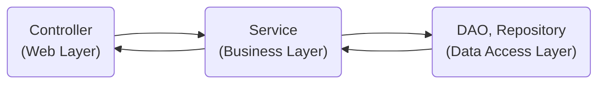

# 헥사고날(육각형), 포트와 어댑터 아키텍처

> 애플리케이션은 비즈니스 관심사를 다루는 내부와 기술적인 관심사를 다루는 외부로 분해된다. 
> 여기서 외부에 포함된 기술적인 컴포넌트를 어댑터라 부르고, 어댑터가 내부와 상호작용하는 접점을 포트라 부른다.

## 계층형 아키텍처의 문제

#### 계층형 아키텍처란?

흔히 사용하는 mvc 패턴의 전형적인 구조이다.

1. 데이터 주도 설계를 유도한다.
   - 객체 모델링은 상태(state)가 아닌 행동(behavior)을 중심으로 모델링해야 하는데, 계층형 아키텍처는 상태를 중심으로 생각하게 만들며 DB 모델링 중심이 된다.
2. 트랜잭션 스크립트를 유도한다.  
   - 중복되는 코드 유발
   - 소스 파악이 힘듬 (전체 코드를 읽고 따라가야 한다.)
3. 유스케이스를 숨긴다.
   - 코드의 의도를 파악하기 힘들다.
4. 지름길을 택하기 쉬워진다.
   - 특정 레이어에 적합한 규칙이 있지만 강제되지 않기에 깨진 창문 이론이 발생할 여지가 높다.
5. 테스트가 어려워진다.
   - 여러 개의 유스케이스를 담당하는 아주 넓은 서비스가 만들어지기도 한다. 
   - UserService >>> JoinUserService 변경이 필요
6. 동시작업이 어렵다.

   